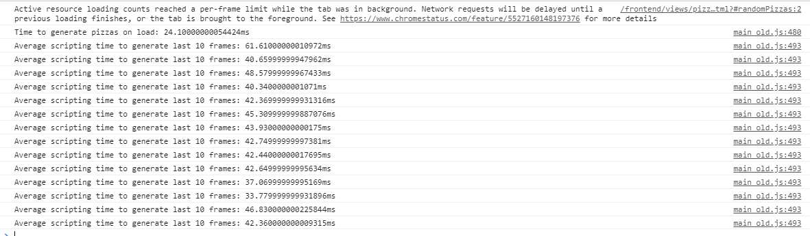
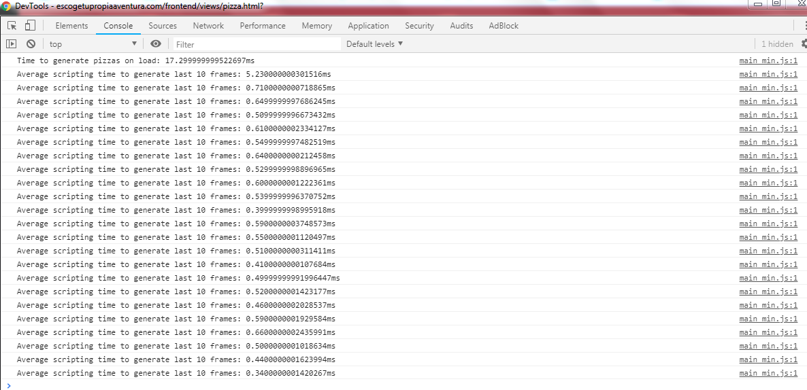

# Performance of main.js

Reduced from

TO

The most important increase of performance is due to:

	if(pizzaTop > innerHeight) {
      break;
    }

at the bottom of the main.js class. With it we only create as much pizzas as the ones that can be visible.